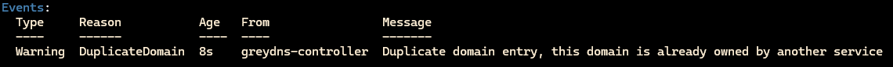

# GreyDNS 🌐

> A lightweight Kubernetes controller for automated DNS management through service annotations

GreyDNS enables development teams to manage their DNS records directly through Kubernetes service annotations, working seamlessly with centrally managed ingress patterns.

**Disclaimer:** _GreyDNS is not meant to replace ExternalDNS for a lot of use cases. It's designed to be a solution to a specific problem that Platform Engineers may run into when trying to empower development teams to manage their own DNS records while maintaining a central point of control for ingress._


## 🚀 Features

- **Annotation-Driven**: Create and manage DNS records using simple Kubernetes service annotations
- **Central Ingress**: Works with centrally managed ingress controllers
- **Real-time Updates**: Automatically syncs DNS records when annotations change
- **Lightweight**: Minimal resource footprint with efficient caching

## 📦 Supported DNS Providers

- **CloudFlare Support**: Native integration with CloudFlare DNS

### Coming Soon

- **AWS Route 53 Support**: Integration with AWS Route 53
- **Google Cloud DNS Support**: Integration with Google Cloud DNS
- **Azure DNS Support**: Integration with Azure DNS

## 📋 Prerequisites

- Kubernetes cluster (1.19+)
- `kubectl` configured to access your cluster

### CloudFlare

- CloudFlare API token with the following permissions:
  - Zone: Read
  - DNS: Edit

## 🛠️ Installation

1. Deploy GreyDNS using kubectl:

    ```sh
    kubectl apply -f https://raw.githubusercontent.com/math280h/greydns/refs/heads/main/deployment.yaml
    ```

2. Create the required ConfigMap:

    ```yaml
    apiVersion: v1
    kind: ConfigMap
    metadata:
      name: greydns-config
      namespace: default
    data:
      record-ttl: "60"
      record-type: "A"
      cache-refresh-seconds: "60"
      ingress-destination: "YOUR_INGRESS_IP"
      proxy-enabled: "true"
    ```

3. Create the CloudFlare API token secret:

    ```sh
    kubectl create secret generic greydns-secret \
    --from-literal=cloudflare=YOUR_API_TOKEN
    ```

## 📝 Usage

Add annotations to your Kubernetes service:

```yaml
apiVersion: v1
kind: Service
metadata:
  name: my-service
  annotations:
    greydns.io/dns: "true"
    greydns.io/domain: "api.example.com"
    greydns.io/zone: "example.com"
spec:
  # ... rest of service spec
```

### Duplicate Records

GreyDNS will automatically deduplicate records based on the namespace and service name. If you create two records at the same time it's first come first serve.

GreyDNS will create an event on the service if it detects a record that is already owned by another service.



## 🔍 Configuration

| Config Key | Description | Required |
|------------|-------------|---------|
| record-ttl | DNS record time-to-live in seconds | True |
| record-type | DNS record type (A or CNAME) | True |
| proxy-enabled | Enable CloudFlare proxy | True |
| cache-refresh-seconds | Cache refresh interval | True |
| ingress-destination | Ingress controller IP address | True |
| proxy-enabled | Enable CloudFlare proxy | True |

## 🤔 Why Not ExternalDNS?

While ExternalDNS is a powerful tool for DNS automation in Kubernetes, GreyDNS takes a different approach:

- Seamlessly integrates with centrally managed ingress controllers
- No CRDs required - uses native Kubernetes annotations
- Reduced complexity compared to ExternalDNS

## 💡 Contributing

Contributions are welcome! Please feel free to submit a Pull Request.

## 📄 License

This project is licensed under the MIT License - see the LICENSE file for details.

---

_Named after Greyson, my rubber duck (who happens to be a cat) 🐱_


