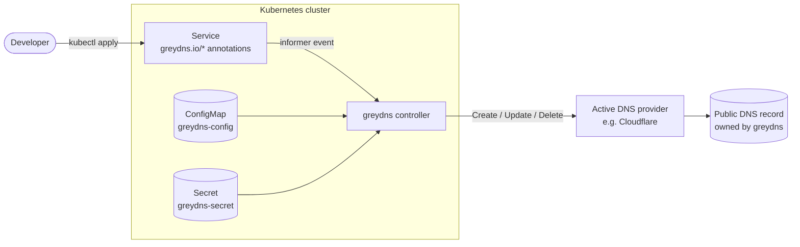

# GreyDNS 🌐

> A lightweight Kubernetes controller for automated DNS management through service annotations

GreyDNS enables development teams to manage their DNS records directly through Kubernetes service annotations, working seamlessly with centrally managed ingress patterns.

**Disclaimer:** _GreyDNS is not meant to replace ExternalDNS for a lot of use cases. It's designed to be a solution to a specific problem that Platform Engineers may run into when trying to empower development teams to manage their own DNS records while maintaining a central point of control for ingress._



```mermaid
flowchart LR
    dev([Developer]) -->|kubectl apply| svc["Service<br/>greydns.io/* annotations"]
    subgraph k8s[Kubernetes cluster]
        svc -->|informer event| ctrl[greydns controller]
        cm[(ConfigMap<br/>greydns-config)] --> ctrl
        sec[(Secret<br/>greydns-secret)] --> ctrl
    end
    ctrl -->|Create / Update / Delete| prov[Active DNS provider<br/>e.g. Cloudflare]
    prov --> dns[(Public DNS record<br/>owned by greydns)]
```

## 🚀 Features

- **Annotation-Driven**: Create and manage DNS records using simple Kubernetes service annotations
- **Central Ingress**: Works with centrally managed ingress controllers
- **Real-time Updates**: Automatically syncs DNS records when annotations change
- **Lightweight**: Minimal resource footprint with efficient caching
- **Observable**: Prometheus metrics exposed on `/metrics` alongside the health probes on port `8080`

## 📦 Supported DNS Providers

GreyDNS uses a pluggable provider system. Exactly one provider is active at a time, selected via the `provider` key in the ConfigMap.

- **CloudFlare**

### Coming Soon

- **Route 53**
- **Google Cloud DNS Support**
- **Azure DNS Support**

See [`docs/adding-a-provider.md`](docs/adding-a-provider.md) for how to add a new provider in a single package.

## 📋 Prerequisites

- Kubernetes cluster (1.19+)
- `kubectl` configured to access your cluster

### CloudFlare

- CloudFlare API token with the following permissions:
  - Zone: Read
  - DNS: Edit

## 🛠️ Installation

1. Deploy GreyDNS using kubectl:

    ```sh
    kubectl apply -f https://raw.githubusercontent.com/math280h/greydns/refs/heads/main/deployment.yaml
    ```

2. Create the required ConfigMap. Generic keys live at the top level; provider-specific keys are namespaced by the provider name (e.g. `cloudflare.proxy-enabled`), so switching providers is purely a config change:

    ```yaml
    apiVersion: v1
    kind: ConfigMap
    metadata:
      name: greydns-config
      namespace: default
    data:
      provider: "cloudflare"
      record-type: "A"
      record-ttl: "60"
      cache-refresh-seconds: "60"
      ingress-destination: "YOUR_INGRESS_IP"
      # Cloudflare-specific
      cloudflare.proxy-enabled: "true"
    ```

3. Create the provider secret. The secret is always named `greydns-secret`; keys are provider-specific:

    ```sh
    # Cloudflare
    kubectl create secret generic greydns-secret \
      --from-literal=cloudflare-token=YOUR_API_TOKEN
    ```

## 📝 Usage

Add annotations to your Kubernetes service:

```yaml
apiVersion: v1
kind: Service
metadata:
  name: my-service
  annotations:
    greydns.io/dns: "true"
    greydns.io/domain: "api.example.com,api-v2.example.com"
    greydns.io/zone: "example.com"
    # Optional per-Service overrides:
    greydns.io/ttl: "300"
    greydns.io/record-type: "AAAA"
    greydns.io/cloudflare-proxied: "true"
spec:
  # ... rest of service spec
```

### Service annotations

| Annotation | Required | Description |
|------------|----------|-------------|
| `greydns.io/dns` | Yes | Must be `"true"` for greydns to manage this Service. |
| `greydns.io/zone` | Yes | Managed DNS zone name (must match a provider-visible zone). |
| `greydns.io/domain` | Yes | Fully-qualified record name(s). Comma-separated list is accepted; one DNS record is created per entry, all in the same zone. |
| `greydns.io/ttl` | No | Positive integer seconds. Overrides the controller-wide `record-ttl`. |
| `greydns.io/record-type` | No | One of the provider's supported record types. Overrides `record-type`. |
| `greydns.io/<provider>-<key>` | No | Provider-scoped override, e.g. `greydns.io/cloudflare-proxied`. |

Invalid override values fall back to the controller default and surface as an `InvalidAnnotation` event on the Service. Per-Service overrides can be restricted cluster-wide via the `allowed-overrides` ConfigMap key; overrides not on the allowlist are ignored with the same event.

### Duplicate Records

GreyDNS will automatically deduplicate records based on the namespace and service name. If you create two records at the same time it's first come first serve.

GreyDNS will create an event on the service if it detects a record that is already owned by another service.


## 🔍 Configuration

### Generic keys

Universal DNS concepts live at the top level so they're not duplicated across providers.

| Config Key | Description | Required |
|------------|-------------|----------|
| `provider` | Active provider name (today: `cloudflare`) | Yes |
| `record-type` | Default record type (`A`, `AAAA`, `CNAME`, ...). Overridable per Service via `greydns.io/record-type`. | Yes |
| `record-ttl` | Default TTL in seconds. Overridable per Service via `greydns.io/ttl`. | Yes |
| `cache-refresh-seconds` | Cache refresh interval | Yes |
| `ingress-destination` | Ingress controller IP address or hostname | Yes |
| `allowed-overrides` | Allowlist of per-Service override suffixes (CSV). Missing key or `*` allows every override; explicit empty string denies every override; otherwise only the listed suffixes (e.g. `ttl,record-type,cloudflare-proxied`) are honoured. Enforced in-process, so Service editors can't bypass it. | No (default allow all) |

### Cloudflare keys (`provider: cloudflare`)

| Config Key | Description | Required |
|------------|-------------|----------|
| `cloudflare.proxy-enabled` | Default proxy setting (`true`/`false`). Overridable per Service via `greydns.io/cloudflare-proxied`. | No (default `false`) |

Secret keys: `cloudflare-token`.

## 📊 Metrics

Prometheus metrics are served on `GET /metrics` on the same port (`8080`) as the health probes.

| Metric | Type | Labels | Description |
|--------|------|--------|-------------|
| `greydns_reconciles_total` | counter | `outcome` | Reconciliations grouped by outcome: `created`, `updated`, `noop`, `duplicate_domain`, `invalid_annotation`, `skipped_stale_cache`, `error`. |
| `greydns_provider_calls_total` | counter | `provider`, `operation`, `outcome` | Provider API calls; `operation` is one of `list_zones`, `list_owned`, `create`, `update`, `delete`; `outcome` is `success` or `error`. |
| `greydns_provider_call_duration_seconds` | histogram | `provider`, `operation` | Provider API call latency. |
| `greydns_cache_records` | gauge | - | Number of DNS records currently in the controller cache. |
| `greydns_retry_queue_depth` | gauge | - | Number of failed deletes pending retry. |
| `greydns_cache_refresh_duration_seconds` | histogram | - | Background cache-refresh latency. |
| `greydns_cache_refresh_last_success_timestamp_seconds` | gauge | - | Unix timestamp of the last successful cache refresh. |
| `greydns_workqueue_depth` | gauge | - | Items currently waiting in the reconcile workqueue. |
| `greydns_workqueue_adds_total` | counter | - | Items added to the workqueue since startup. |
| `greydns_workqueue_retries_total` | counter | - | Reconciles that failed and were requeued with backoff. |

## 🤔 Why Not ExternalDNS?

While ExternalDNS is a powerful tool for DNS automation in Kubernetes, GreyDNS takes a different approach:

- Seamlessly integrates with centrally managed ingress controllers
- No CRDs required - uses native Kubernetes annotations
- Reduced complexity compared to ExternalDNS

## 💡 Contributing

Contributions are welcome! Please feel free to submit a Pull Request.

## 📄 License

This project is licensed under the MIT License - see the LICENSE file for details.

---

_Named after Greyson, my rubber duck (who happens to be a cat) 🐱_


